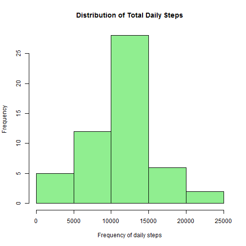
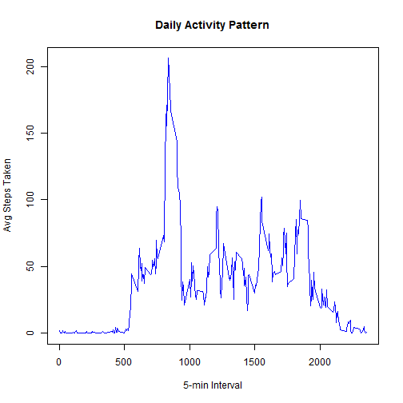
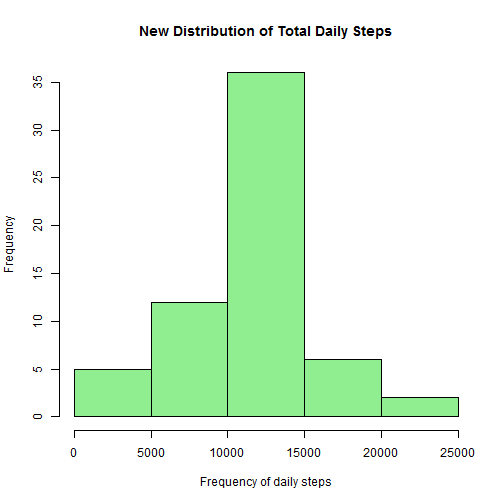
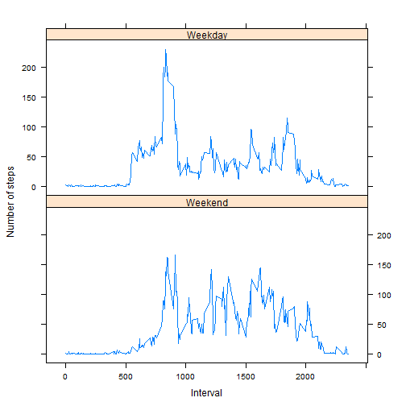

# Activity Monitoring Data
================================
        
        
        
## 1. Loading and preprocessing the data        
        
        
***Loading/Processing the data in R and obtaining an overview of the data***
        

```r
# Install necessery packages for data analysis.

library(data.table)
library(codetools)
library(lattice)
library(knitr)

# Open data (saved in directory) and coarce the classes for each column to fit appropriate one. 

activity <- read.csv("activity.csv", colClasses = c("numeric", "Date", "numeric"))
head(activity)
```

```
##   steps       date interval
## 1    NA 2012-10-01        0
## 2    NA 2012-10-01        5
## 3    NA 2012-10-01       10
## 4    NA 2012-10-01       15
## 5    NA 2012-10-01       20
## 6    NA 2012-10-01       25
```


***Dealing with missing values***
        

```r
# Exclude all na values from data.
data <- na.omit(activity)
```


## 2. What is mean total number of steps taken per day?


***Converting data from intervals per day to total number of steps per day***
        

```r
dailysteps <- rowsum(data$steps, format(data$date, "%d-%m-%Y"))
```


***Obtaining the histogram of the total number of steps taken each day***
        

```r
hist(dailysteps, main = "Distribution of Total Daily Steps", xlab = "Frequency of daily steps", col="lightgreen")
```

 


***Obtaining the mean and median of the total number of steps taken per day***
        

```r
stepsmean <- mean(dailysteps)
stepsmedian <- median(dailysteps)
```

The mean and median of the total number of steps taken per day are **10766.19** (stepsmean) and **1076** (stepsmedian),respectively.


## 3. What is the average daily activity pattern?


***Finding the average number of steps taken, averaged across all days***
        

```r
int <- data.table(data$interval, data$steps)
avgstep <- data.frame(int[, mean(V2), by="V1"])
names(avgstep) <- c("interval", "steps") 
```


***Make a time series plot of the 5-minute interval and the avg number of steps***
        

```r
plot.ts(avgstep$interval, avgstep$steps, type = "l", main="Daily Activity Pattern", xlab="5-min Interval", ylab="Avg Steps Taken", col="blue")
```

 

***Finding the 5-minute interval, which contains the maximum number of steps***
        

```r
maxsteps <- subset(avgstep, steps == max(avgstep$steps))
maxint <- maxsteps$interval
```

The 5-minute interval, on average across all the days in the dataset, that contains the maximum number of steps is **835** (maxint). 


## 4. Imputing missing values


***Calculating and reporting total number of missing values***
        

```r
totalna <- sum(complete.cases(activity) == FALSE)
```

The total number of missing values in the dataset is **2304** (totalna).


***Filling in missing values***
        

```r
# We will use the mean for that 5-minute interval to fill in the missing values. In order to achieve this, we will use the "avgstep" data frame, which includes the intervals and the means for each interval, accross all days. Then, we will merge this new data set with the original data set "activity", by interval, and replace all missing values with mean for that interval. To conclude, we will create a new data set that is equal to the original dataset but with the missing data filled in. 

r <- merge(activity, avgstep, by="interval", suffixes=c(".activity", ".avgsteps"))
r$newsteps <- ifelse(is.na(r$steps.activity), r$steps.avgstep, r$steps.activity)
activitynew <- data.frame(r$interval, r$date, r$newsteps)
names(activitynew) <- c("interval", "date", "steps")
head(activitynew)
```

```
##   interval       date steps
## 1        0 2012-10-01 1.717
## 2        0 2012-11-23 0.000
## 3        0 2012-10-28 0.000
## 4        0 2012-11-06 0.000
## 5        0 2012-11-24 0.000
## 6        0 2012-11-15 0.000
```


***Make a histogram of the total number of steps taken each day***
        

```r
#Converting data from intervals per day to total number of steps per day***
dailystepsnew <- rowsum(activitynew$steps, activitynew$date)

#Obtaining the histogram of the total number of steps taken each day***
hist(dailystepsnew, main = "New Distribution of Total Daily Steps", xlab = "Frequency of daily steps", col="lightgreen")
```

 


***Obtaining the new mean and median of the total number of steps taken per day***
        

```r
stepsmeannew <- mean(dailystepsnew)
stepsmediannew <- median(dailystepsnew)
```

The mean and median of the total number of steps taken per day are **10766.19** (stepsmeannew) and **10766.19** (stepsmediannew) ,respectively. 

The mean is the same as with the original data set sine we used means of steps to replace na's. As a result, since we have replaced na values with values that are equal to means and closer to overall data set, the median of the total number of steps taken per day is now the same as the mean. The dataset is less skewed by replacing na values with actual values, which shift averages and median to the dataset mean value. 


## 5. Are there differences in activity patterns between weekdays and weekends?


***Create a new factor variable with two levels: "weekday" and "weekend".***


```r
activitynew$day <- factor(ifelse(as.POSIXlt(activitynew$date)$wday %% 6 == 0, "Weekend", "Weekday"))
```

***Finding the average number of steps taken, averaged across all days***


```r
int2 <- data.table(activitynew)
avgstepnew <- data.frame(int2[, mean(steps), by="interval,day"])
names(avgstepnew) <- c("interval", "day", "steps")
```


***Make a time series plot of the 5-minute interval and the avg number of steps, averaged across all weekday days or weekend days***


```r
xyplot(avgstepnew$steps ~ avgstepnew$interval | day, data=avgstepnew, type="l",
layout=c(1, 2), as.table=T, xlab="Interval", ylab="Number of steps")
```

 
